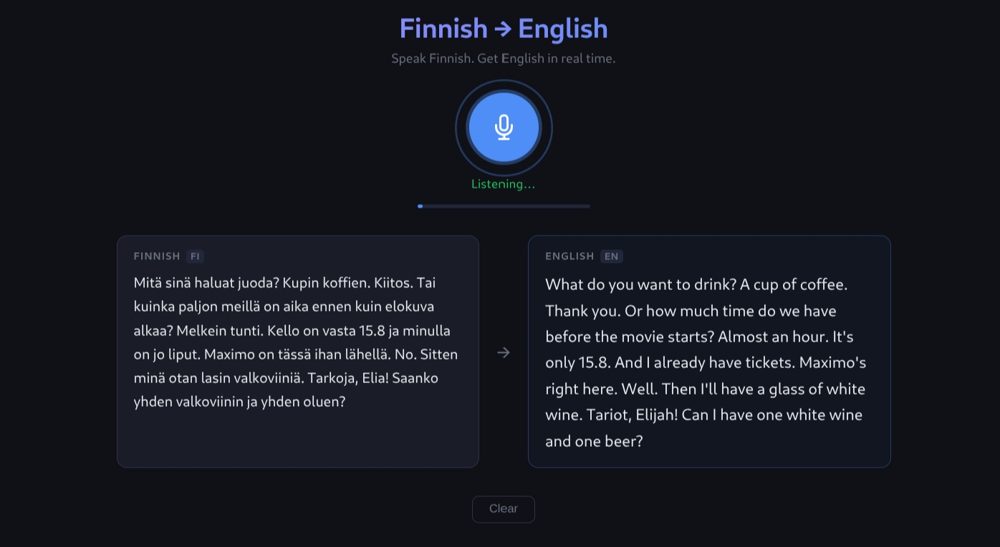

# Finnish &rarr; English Live Translator

Real-time speech translation that captures Finnish audio from your microphone, transcribes it, and translates it to English — all streamed over a WebSocket.




## How It Works

```
Microphone (16 kHz PCM) ──WebSocket──> FastAPI Server
                                         ├─ faster-whisper (Finnish ASR)
                                         └─ MarianMT (fi → en translation)
                                              │
Browser UI <──────────JSON──────────────────────┘
  ├─ Finnish transcript
  └─ English translation
```

1. The browser captures microphone audio at 16 kHz via the Web Audio API (AudioWorklet).
2. Raw PCM float32 chunks are streamed to the backend over a WebSocket every 100 ms.
3. The server buffers audio and processes it when it detects a speech pause or the buffer reaches 5 seconds.
4. Speech recognition (faster-whisper) transcribes the Finnish audio to text.
5. Machine translation (MarianMT) converts the Finnish text to English.
6. Results are pushed back as JSON: `{"finnish": "...", "english": "..."}`.

## Models

| Task | Model | Source |
|------|-------|--------|
| Speech Recognition | faster-whisper `large-v3-turbo` | [OpenAI Whisper](https://github.com/openai/whisper) |
| Translation | MarianMT `opus-mt-fi-en` | [Helsinki-NLP](https://huggingface.co/Helsinki-NLP/opus-mt-fi-en) |

## Project Structure

```
finnish-translator/
├── backend/
│   ├── server.py            # FastAPI WebSocket server with ASR + translation
│   ├── modal_app.py         # Optional Modal GPU deployment config
│   └── requirements.txt     # Python dependencies
├── frontend/
│   ├── index.html           # Main UI
│   ├── app.js               # Audio capture, WebSocket client, UI logic
│   └── style.css            # Dark theme styling
└── README.MD
```

## Prerequisites

- **Python 3.11+**
- **~2 GB disk space** for model downloads (Whisper ~1.6 GB, MarianMT ~300 MB)
- A modern browser with microphone access (Chrome, Firefox, Edge)
- Optional: NVIDIA GPU with CUDA for faster inference

## Setup

### 1. Install dependencies

```bash
cd backend
pip install -r requirements.txt
```

### 2. Start the backend

```bash
uvicorn server:app
```

On first launch, models will be downloaded automatically. Wait for the log message:

```
All models ready (device=cpu).
```

> **Note:** If you have an NVIDIA GPU with CUDA, the server auto-detects it and uses GPU acceleration with float16 precision. On CPU, it uses int8 quantization.

### 3. Open the frontend

```bash
cd frontend
python -m http.server 5500
```

Navigate to `http://localhost:5500` in your browser.

### 4. Use it

Click the microphone button and start speaking Finnish. The transcription and translation appear in real time in the two panels.

## Configuration

Audio processing parameters can be adjusted in `backend/server.py`:

| Parameter | Default | Description |
|-----------|---------|-------------|
| `SAMPLE_RATE` | 16000 | Expected audio sample rate (Hz) |
| `SILENCE_THRESHOLD` | 0.02 | RMS level below which audio is considered silent |
| `SILENCE_DURATION` | 0.5 | Seconds of silence before triggering processing |
| `MAX_BUFFER_SECONDS` | 5 | Force processing after this many seconds |
| `OVERLAP_SECONDS` | 0.3 | Audio overlap between segments for context |

## API

### `GET /health`

Health check endpoint. Returns `{"status": "ok"}` when the server and models are loaded.

### `WebSocket /ws`

Streaming speech translation endpoint.

- **Client sends:** Raw PCM float32 binary frames (16 kHz, mono)
- **Client sends:** `"flush"` text message to process remaining audio on stop
- **Server sends:** `{"finnish": "...", "english": "..."}` JSON messages
- **Server sends:** `{"done": true}` after flush completes

## License

MIT
